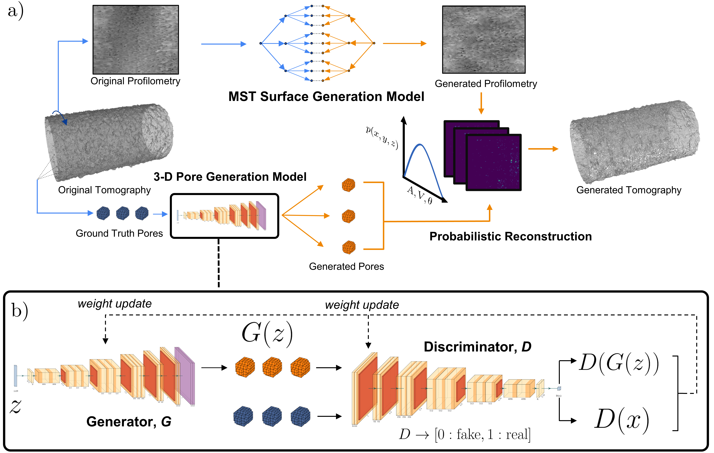
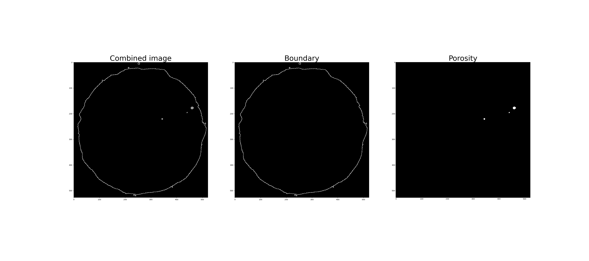

# Deep Learned Generators of Porosity Distributions produced during Metal Additive Manufacturing


This repository is the implementation of the paper "Deep Learned Generators of Porosity Distributions produced during Metal Additive Manufacturing", linked [here](https://arxiv.org/abs/2205.05794). The project uses Generative Adversarial Networks and Scattering Transformations to create stochastic realizations of synthetic parts from a limited dataset of experimental parts. The overall generation process is divided into three subproblems, the generation of individual pores, the generation of the surface boundary, and the recombination of the generated pores with the generated surface boundary to form a completed part.


## Dataset
This dataset used for this work comprised of segmented CT scans of 12 Al-10Si-Mg tensile samples, produced using Laser Powder Bed Fusion. These CT scans consist of individual segmented cross-sections, cut perpendicular to the tensile axis. Each CT scan cross-section consists of the boundary defining the edge of the solid phase of the part, as well as the void spaces that define the pores present in the part. 




## Prerequisites 
The following additional packages are required in order to run the associated code:
* ```appdirs==1.4.4```
* ```termcolor==1.1.0```
* ```scikit_image==0.16.2```
* ```seaborn==0.11.2```
* ```pytest==6.0.1```
* ```tqdm==4.62.3```
* ```tifffile==2021.4.8```
* ```torch==1.8.1+cu101```
* ```h5py==2.10.0```
* ```torchvision==0.9.1+cu101```
* ```pandas==1.2.0```
* ```imageio==2.9.0```
* ```cupy==10.5.0```
* ```librosa==0.9.1```
* ```numba==0.55.2```
* ```Pillow==9.1.1```
* ```scikit_learn==1.1.1```
* ```skimage==0.0```
* ```torchnet==0.0.4```

These packages can be installed independently, or all at once by running ```pip install -r requirements.txt```. We recommend that these packages are installed in a new conda environment to avoid version clashes with existing package installations. Instructions on defining a new conda environment can be found [here](https://conda.io/projects/conda/en/latest/user-guide/tasks/manage-environments.html).

## Usage
The overall workflow for this project first analyzes a given experimental CT part sample to extract the individual pore morphologies, surface roughness profiles, and global pore distributions. Next, this information is used to train the Generative Adversarial Network used to generate new pore information, as well as the MST-based microcanonical model necessary to create new surface realizations. During this process, statistical comparisons between the ground truth and synthetic data are made to ensure the key properties of the experimental sample are recreated in the synthetic parts. A hands-on example of this process is demonstrated in the ```Demo_Part_Generation.ipynb``` notebook. 


### Overview
* ```analyze_pore_samples/``` contains the workflow for extracting the necessary data from experimental part samples. To run the overall analysis pipeline, run ``` python analyze_pore_samples/analyze_porosity_clean.py```, and specify the directory containing CT scans of the dataset as an argument to the script. 

* ```make_surface/``` contains the pipeline for training the microcanonical MST model, as first proposed by Zhang et al. (2021) [](https://www.sciencedirect.com/science/article/pii/S106352032100004X). Given  the index of the original data folder, and a sample image, the ```generate_surface()``` function within ```generate_surfaces.py``` will perform the optimization process, saving ```k``` realizations during the optimization process.

* ```reconstruction/``` contains the workflow for training the GAN model to create new pore morphologies from the existing pore distribution, as well as the code for the stochastic recombination of the pore phase with the generated boundary. The GAN training process can be initiated by running the command ```python main_train_pores.py```, which will save model objects containing the trained generator parameters. These saved models can be used to generate new pore examples with the ```pore_generate.py``` script. 

* ```reconstruction/pipeline_clean.py```, given the directory of generated boundaries and pore morphologies, stochastically combines them using the probability distributions extracted from the ```analyze_porosity_clean.py``` process. After running this script, the individual generated parts will be saved as binary ```numpy``` arrays (.npy), where `1` indicates the presence of solid material, and `0` corresponds to void space.


### Disclaimer
<sub> SAND2022-17070 O <sub>
  
  
<sub>No sensitivities are found therein. The following software does not incorporate data encryption
algorithms, it does not incorporate data authentication algorithms, and it cannot be used in
massively parallel computing.<sub>

<sub>Sandia National Laboratories is a multimission laboratory managed and operated by National Technology & Engineering Solutions of Sandia, LLC, a wholly owned subsidiary of Honeywell International Inc., for the U.S. Department of Energy’s National Nuclear Security Administration under contract DE-NA0003525. 
Based on the description of the code and data, a Derivative Classifier (DC) and a Subject Matter Expert (SME) assert that the code and associated data have no sensitivities and should be deemed Unclassified Unlimited Release (UUR), although they did not physically review every line of code due to its size.<sub>
